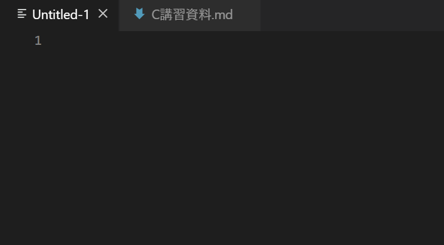

<font color="black" size="7" face="Comic Sans MS">
    <center>C言語講習2019</center>
</font>

<div style="padding:10px;border-radius: 10px; border: 5px double #0000ff;">
    <font size=6>著者</font>
    <br></br>
    <div style="text-align: left;">
        <font size=4>
        資料作成 全体解説：
        <a href="https://twitter.com/yuina_blend">@yuina_blend</a>
        </font>
    <br></br>
        <font size=4>
        問題作成 一部解説：
        <a href="https://twitter.com/eaB17kNZp05kZGI">@eaB17kNZp05kZGI</a>
</font>
<br></br>
</div></div>
<br></br>

<font size=6>目次</font>

- [イントロダクション](#%e3%82%a4%e3%83%b3%e3%83%88%e3%83%ad%e3%83%80%e3%82%af%e3%82%b7%e3%83%a7%e3%83%b3)
  - [プログラムとは](#%e3%83%97%e3%83%ad%e3%82%b0%e3%83%a9%e3%83%a0%e3%81%a8%e3%81%af)
  - [ソースコードとは](#%e3%82%bd%e3%83%bc%e3%82%b9%e3%82%b3%e3%83%bc%e3%83%89%e3%81%a8%e3%81%af)
  - [コンパイルとは](#%e3%82%b3%e3%83%b3%e3%83%91%e3%82%a4%e3%83%ab%e3%81%a8%e3%81%af)
  - [C言語について](#c%e8%a8%80%e8%aa%9e%e3%81%ab%e3%81%a4%e3%81%84%e3%81%a6)
- [第0章 環境構築](#%e7%ac%ac0%e7%ab%a0-%e7%92%b0%e5%a2%83%e6%a7%8b%e7%af%89)
  - [gccの導入](#gcc%e3%81%ae%e5%b0%8e%e5%85%a5)
  - [エディタのインストール](#%e3%82%a8%e3%83%87%e3%82%a3%e3%82%bf%e3%81%ae%e3%82%a4%e3%83%b3%e3%82%b9%e3%83%88%e3%83%bc%e3%83%ab)
  - [設定](#%e8%a8%ad%e5%ae%9a)
  - [VSCodeのつかいかた](#vscode%e3%81%ae%e3%81%a4%e3%81%8b%e3%81%84%e3%81%8b%e3%81%9f)
- [第1章 Hello world!!](#%e7%ac%ac1%e7%ab%a0-hello-world)
  - [日本語と改行について](#%e6%97%a5%e6%9c%ac%e8%aa%9e%e3%81%a8%e6%94%b9%e8%a1%8c%e3%81%ab%e3%81%a4%e3%81%84%e3%81%a6)
  - [コメント](#%e3%82%b3%e3%83%a1%e3%83%b3%e3%83%88)
  - [練習問題1-1](#%e7%b7%b4%e7%bf%92%e5%95%8f%e9%a1%8c1-1)
- [第2章 演算子と書式指定子](#%e7%ac%ac2%e7%ab%a0-%e6%bc%94%e7%ae%97%e5%ad%90%e3%81%a8%e6%9b%b8%e5%bc%8f%e6%8c%87%e5%ae%9a%e5%ad%90)
  - [演算子](#%e6%bc%94%e7%ae%97%e5%ad%90)
  - [練習問題2-1](#%e7%b7%b4%e7%bf%92%e5%95%8f%e9%a1%8c2-1)
  - [書式指定子](#%e6%9b%b8%e5%bc%8f%e6%8c%87%e5%ae%9a%e5%ad%90)
  - [練習問題2-2](#%e7%b7%b4%e7%bf%92%e5%95%8f%e9%a1%8c2-2)
- [第3章 変数](#%e7%ac%ac3%e7%ab%a0-%e5%a4%89%e6%95%b0)
  - [変数](#%e5%a4%89%e6%95%b0)
  - [いろんな型](#%e3%81%84%e3%82%8d%e3%82%93%e3%81%aa%e5%9e%8b)
  - [例題3-1](#%e4%be%8b%e9%a1%8c3-1)
  - [初期化](#%e5%88%9d%e6%9c%9f%e5%8c%96)
  - [練習問題3-1](#%e7%b7%b4%e7%bf%92%e5%95%8f%e9%a1%8c3-1)
  - [キャスト](#%e3%82%ad%e3%83%a3%e3%82%b9%e3%83%88)
  - [入力](#%e5%85%a5%e5%8a%9b)
  - [例題3-2](#%e4%be%8b%e9%a1%8c3-2)
  - [練習問題3-2](#%e7%b7%b4%e7%bf%92%e5%95%8f%e9%a1%8c3-2)
- [第4章 条件分岐](#%e7%ac%ac4%e7%ab%a0-%e6%9d%a1%e4%bb%b6%e5%88%86%e5%b2%90)
  - [関係演算子](#%e9%96%a2%e4%bf%82%e6%bc%94%e7%ae%97%e5%ad%90)
  - [論理演算子](#%e8%ab%96%e7%90%86%e6%bc%94%e7%ae%97%e5%ad%90)
  - [if文](#if%e6%96%87)
  - [else文](#else%e6%96%87)
  - [例題4-1](#%e4%be%8b%e9%a1%8c4-1)
  - [else if文](#else-if%e6%96%87)
  - [練習問題4-1](#%e7%b7%b4%e7%bf%92%e5%95%8f%e9%a1%8c4-1)
  - [練習問題4-2](#%e7%b7%b4%e7%bf%92%e5%95%8f%e9%a1%8c4-2)
  - [switch文](#switch%e6%96%87)
  - [例題4-2](#%e4%be%8b%e9%a1%8c4-2)
  - [練習問題4-3](#%e7%b7%b4%e7%bf%92%e5%95%8f%e9%a1%8c4-3)
- [第5章 繰り返し文](#%e7%ac%ac5%e7%ab%a0-%e7%b9%b0%e3%82%8a%e8%bf%94%e3%81%97%e6%96%87)
  - [for文](#for%e6%96%87)
  - [代入演算子](#%e4%bb%a3%e5%85%a5%e6%bc%94%e7%ae%97%e5%ad%90)
  - [例題5-1](#%e4%be%8b%e9%a1%8c5-1)
  - [練習問題5-1](#%e7%b7%b4%e7%bf%92%e5%95%8f%e9%a1%8c5-1)
  - [while文](#while%e6%96%87)
  - [例題5-2](#%e4%be%8b%e9%a1%8c5-2)
  - [練習問題5-2](#%e7%b7%b4%e7%bf%92%e5%95%8f%e9%a1%8c5-2)
  - [ネスト](#%e3%83%8d%e3%82%b9%e3%83%88)
  - [練習問題5-2](#%e7%b7%b4%e7%bf%92%e5%95%8f%e9%a1%8c5-2-1)
- [第6章 配列](#%e7%ac%ac6%e7%ab%a0-%e9%85%8d%e5%88%97)
  - [配列](#%e9%85%8d%e5%88%97)
  - [配列の初期化](#%e9%85%8d%e5%88%97%e3%81%ae%e5%88%9d%e6%9c%9f%e5%8c%96)
  - [例題6-1](#%e4%be%8b%e9%a1%8c6-1)
  - [文字列](#%e6%96%87%e5%ad%97%e5%88%97)
  - [例題6-2](#%e4%be%8b%e9%a1%8c6-2)
  - [多次元配列](#%e5%a4%9a%e6%ac%a1%e5%85%83%e9%85%8d%e5%88%97)
- [第7章 関数](#%e7%ac%ac7%e7%ab%a0-%e9%96%a2%e6%95%b0)
  - [関数の定義](#%e9%96%a2%e6%95%b0%e3%81%ae%e5%ae%9a%e7%be%a9)
  - [ローカル変数とグローバル変数](#%e3%83%ad%e3%83%bc%e3%82%ab%e3%83%ab%e5%a4%89%e6%95%b0%e3%81%a8%e3%82%b0%e3%83%ad%e3%83%bc%e3%83%90%e3%83%ab%e5%a4%89%e6%95%b0)
  - [引数と戻り値](#%e5%bc%95%e6%95%b0%e3%81%a8%e6%88%bb%e3%82%8a%e5%80%a4)
  - [例題7-1](#%e4%be%8b%e9%a1%8c7-1)
  - [プロトタイプ宣言](#%e3%83%97%e3%83%ad%e3%83%88%e3%82%bf%e3%82%a4%e3%83%97%e5%ae%a3%e8%a8%80)
  - [例題7-2](#%e4%be%8b%e9%a1%8c7-2)
  - [練習問題7-1](#%e7%b7%b4%e7%bf%92%e5%95%8f%e9%a1%8c7-1)
  - [練習問題7-2](#%e7%b7%b4%e7%bf%92%e5%95%8f%e9%a1%8c7-2)
- [第8章 アドレスとポインタ](#%e7%ac%ac8%e7%ab%a0-%e3%82%a2%e3%83%89%e3%83%ac%e3%82%b9%e3%81%a8%e3%83%9d%e3%82%a4%e3%83%b3%e3%82%bf)
  - [メモリとアドレス](#%e3%83%a1%e3%83%a2%e3%83%aa%e3%81%a8%e3%82%a2%e3%83%89%e3%83%ac%e3%82%b9)
  - [ポインタ](#%e3%83%9d%e3%82%a4%e3%83%b3%e3%82%bf)
  - [間接演算子](#%e9%96%93%e6%8e%a5%e6%bc%94%e7%ae%97%e5%ad%90)
  - [例題8-1](#%e4%be%8b%e9%a1%8c8-1)
  - [値渡しと参照渡し](#%e5%80%a4%e6%b8%a1%e3%81%97%e3%81%a8%e5%8f%82%e7%85%a7%e6%b8%a1%e3%81%97)
  - [配列とポインタ](#%e9%85%8d%e5%88%97%e3%81%a8%e3%83%9d%e3%82%a4%e3%83%b3%e3%82%bf)
- [第9章 構造体](#%e7%ac%ac9%e7%ab%a0-%e6%a7%8b%e9%80%a0%e4%bd%93)
  - [構造体の宣言](#%e6%a7%8b%e9%80%a0%e4%bd%93%e3%81%ae%e5%ae%a3%e8%a8%80)
  - [構造体とポインタ](#%e6%a7%8b%e9%80%a0%e4%bd%93%e3%81%a8%e3%83%9d%e3%82%a4%e3%83%b3%e3%82%bf)
- [参考](#%e5%8f%82%e8%80%83)

<div style="page-break-before:always"></div>

# イントロダクション
## プログラムとは

**プログラム** とは、さまざまなコンピュータに対する命令を書いたものです。

このプログラムを書くことを、**プログラミング** と言います。

プログラムを書くことの利点は大きくわけて2つあります。

1. 何度も実行できる
2. （書いたコードに対しては）ミスが決してない

また、プログラミングは次の手順で進められます。

1. ソースコードを書く
2. コンパイルをする
3. 実行する

## ソースコードとは

**ソースコード** とは、コンピュータに命令を送るために、人が理解できる言語で書かれたファイルです。

人が話す言語に日本語や英語があるように、ソースコードにも言語があって、
これを **プログラム言語** と言います。
今回は`C言語`をつかってプログラムをかきます。

プログラム言語は他にも、 `C++` ,　`C#` , `Java`や`Python` などがあります。

## コンパイルとは
**コンパイル** とは、人が理解できるソースコードをパソコンが理解できる`0`と`1`からなるファイルに翻訳するものです。

また、そのコンパイルを行うものを **コンパイラ** といいます。

今回使うコンパイラは`gcc`です。

コンパイルを行うときに、ソースコードの構文が間違っていないかをチェックして、どこかが間違っていたらコンパイラからエラーが吐き出され、間違いが無ければ、実行ファイルが作成されます。

## C言語について
この講習で学ぶのは**C言語**というプログラミング言語です。この言語はロボットに命令をする **マイコン**と呼ばれるもの（詳しくは別の講習で扱います）で使います。

今回の講習では制御に必要な必要最低限の文法をメインに勉強していきます。

<div style="page-break-before:always"></div>

# 第0章 環境構築

この章ではCを勉強するための環境構築をします。

## gccの導入
[gccの入れ方](https://webkaru.net/clang/mingw-gcc-install/)←ここを参考にgccを自分のPCにインストールしましょう。gccとはCのコンパイラです。インストールできたらコマンドプロンプトで`gcc -v`と打ってみましょう。バージョン情報がでればインストール完了です。


</img>  

↑こんな感じになればOK
## エディタのインストール
エディタには沢山の種類があり、それぞれ色々な特徴があります。  
今回は**VSCode**というエディタをみなさんには入れてもらいます（著者のオヌヌメ）
[VSCode](https://code.visualstudio.com/)←ここからVSCodeをインストールしましょう。

## 設定  
デフォは英語なので日本語にしたい人は調べてやってください（適当)  
[ここ](https://www.karelie.net/vscode-visual-studio-code-japanese/)とか見ればたぶんできます。 

  
</img>  


</img>

`Ctrl`+`Shift`+`x`を押し、この2つのプラグインを検索して入れましょう（インストールを押すだけ）


</img>

インストールが終わったら`Ctrl`+`Shift`+`p`を押しましょう。そしたらなんか窓が出てくるので`setting`と入れると**基本設定：設定（JSON）を開く**という項目が出てくるので、これを開きましょう。


</img>

開くとこんな感じになるので、最初の`{`の後に⇓をコピペして保存してください。（保存は`Ctrl`+`s`）
```
    "terminal.integrated.shell.windows": "C:\\WINDOWS\\System32\\cmd.exe",
    "code-runner.clearPreviousOutput": true,
    "code-runner.runInTerminal": true,
```
できたら一度VSCodeを再起動して、`Ctrl`+`@`を押してみましょう。


</img>

↑のようにコマンドプロンプトが開けたら問題ありません。

また、この資料でのショートカットはすべて`Atom Keymap`に準拠しているので必要ならパッケージをインストールしましょう。

<div style="page-break-before:always"></div>

## VSCodeのつかいかた
ここではC言語のプログラムを作成するまでの流れを説明しときます。詳しくは書かないのでわからないことは調べるか聞いてください。  

まずは適当な場所にフォルダを作りましょう  

</img>  
VSCodeを開いたら`Ctrl`+`Shift`+`o`でフォルダを開きます  


</img>

※さっき作ったフォルダを開く  

開けたら`Ctrl`+`n`で新しいファイルが作れる（この時点では保存はされてない）ので作りましょう。  


</img>

**Untitled-n**（nは自然数）というものが作られる（上図）と思うので、`Ctrl`+`Shift`+`s`で名前を付けて保存しましょう。 


</img>

この時、ファイルの名前は必ず`なんとか`**.c**で保存しましょう。**.c**というのはCのファイルであることを表す拡張子というものです。よくわかんないかもしれませんがとりあえずファイル名の最後が **.c**なら基本的になんでも大丈夫です（半角英数字が好ましい）。  

以上がCのファイルを作る流れになります。あとはここにコードをかきかきして実行とか何かいろいろしていきます。

<div style="page-break-before:always"></div>

# 第1章 Hello world!!

ではいよいよコードを書いてみましょう！  

...といっても最初はコピペです。とりあえず以下のよくわからん暗号みたいなのがCのプログラムです。どの言語でも最初は画面に**Hello world**を表示させるのがなぜかお決まりなので、下のコードを自分の **.c**ファイルに貼り付けて実行してみましょう。  
プログラムの実行は保存してから`Ctrl`+`Alt`+`n`です。これだけでコンパイルと実行をしてくれます。**便利でしょ？**

```c
//hello_world.c
#include <stdio.h>

int main()
{
    printf("Hello world!!");

    return 0;
}
```

- 実行結果
  
```
Hello world!!
```
実行するとこのようにコマンドプロンプト上に表示されると思います。要点をおさえてコードを見ていきましょう。

```c
#include <stdio.h>
```

これは`stdio.h`というファイルを読み込むという命令です。これを読み込む（include）すると、標準入出力というものが使えるようになります。まぁ最初はとりあえず書いとくものという認識で大丈夫です。  

```c
int main()
{
    //ここに命令を書く
    return 0;
}
```

↑は`main文`と呼ばれるもので、基本的には **{ ここ }** の間に自分がしたい命令を書いていきます。これもとりあえず書いとくものという認識で最初は大丈夫です。

```c
printf("Hello world!!");
```
これは画面上に **"ここの文字"** をする命令です。**"** ←これは**ダブルクォーテーション**と読みます。基本的にはダブルクォーテーションの中を出力するものと考えてください。  

また、各命令の終わりには **;（セミコロン）** を付ける必要があります。試しに先ほどのHello worldのコードのセミコロンを消してみましょう。  


</img>

こんな感じで**問題**というところで何か怒られてますね。 **このように問題が１つでもある場合はコンパイルができません!** エラーメッセージを見ながらどこがダメなのか修正しながらコードを書いていきましょう。  

## 日本語と改行について

`printf`ではもちろん日本語を出力することもできます。しかし、そのまま実行すると文字化けします。これは**文字コード**というものが自分で書いたコードとコマンドプロンプトの文字コードが違うことで起きてしまいます。これを避けるために、日本語を出力する際は以下のコードを付け足してください。また、改行をする際は`\n`と書きましょう。
```c
#include <stdlib.h>

system("chcp 65001");
```

具体的に書くとこんな感じです

```c
#include <stdio.h>
#include <stdlib.h>

int main()
{
    system("chcp 65001");

    printf("日本語出力のテスト\nあいうえお");

    return 0;
}
```

- 出力結果

```
Active code page: 65001
日本語出力のテスト
あいうえお
```
正しく出力されていることがわかります。試しに`system("chcp 65001");`の部分や、`printf`内の`\n`を消して実行してみましょう。

## コメント

`//` か `/* ここにコメント */`を使うことでコード内にコメントを残すことができます。コメントはコンパイラから無視されます。これを使って、どこでどんな動作をしているのかコメントとして残したり、特定の箇所をコメント化して一時的に除外することもできます。特に後者は**コメントアウト**と呼ばれ、よく使うので覚えておきましょう。 

```c
#include <stdio.h>
//ここはコメントなので無視される

/*
ここも無視される
*/

int main()
{
    //printf("abc\n");  コメントアウトしてるのでここは実行されない
    printf("def\n");

    return 0;
}
```

- 実行結果

```
def

```

これで**Hello world**の章は終わりです。最後に要点をおさえましょう。  

- テンプレは以下の通り  

```c
#include <stdio.h>
#include <stdlib.h>

int main()
{
    system("chcp 65001");
    //ここにコードを書く！！！
    return 0;
}
```
- 命令の終わりは`;`
- 改行は`\n`
- `//` か `/* */`でコメント

練習問題も解いてみましょう！

## 練習問題1-1

**問題文**

自分の氏名と学年、所属を出力してください。


<div style="page-break-before:always"></div>

# 第2章 演算子と書式指定子

## 演算子

Cには基本的な演算子が5つあります
|  演算子  |  演算  |  書式  |  意味  |
| ---- | ---- | ---- | ---- | ---- |
| + | 加算 | a + b | aにbを足す|
| - | 減算 | a - b | aからbを引く|
| * | 乗算 | a * b | aにbを掛ける|
| / | 除算 | a / b | aをbで割る |
| % | 剰余算 | a % b | aをbで割った余りを求める|

計算は基本的にこれらの**演算子**と呼ばれるものを使って表現します。計算の順序は算数と同じで`*`と`/`と`%`が`+`と`-`より優先され、`()`を含む場合はそこが優先されます。少し練習してみましょう。

## 練習問題2-1
**問題文**

次の計算結果を求めましょう。

(1) **5 + 4 - 3**

(2) **2 + 4 / 2**

(3) **(3 + 5) - 6 % 3**

## 書式指定子
書式指定子とは`%d`や`%f`のように表され、printfにおいては「printf(**"",〇〇**)」の後に並ぶ数値や変数などの内容を画面にどのように出力するかを指定する記号です。例えば
```c
printf("%d",2 + 1);
```
このように記述すると、出力は
```
3
```
というようになります。
指定子には種類があり、以下の通りになっています（一部のみ記述）

| 指定子 | データ型 |
| ---- | ---- |
| %d | 整数（１０進数）|
| %f | 実数 |
| %x | １６進数 |
| %c | 文字（１文字）|
| %s | 文字列 |

また、書式指定子は複数使うことができ、その場合は記述の順番に対応します。例を書くと

```c
printf("%d : %d",1,2);
```
このように複数書式指定子を使うことができ、出力は

```
1 : 2
```
というように順番に出力されます。

## 練習問題2-2
**問題文**

練習問題2-1の式を書式指定子を使って出力してみましょう。

<div style="page-break-before:always"></div>

# 第3章 変数
## 変数
変数とは、様々なデータを一時的に保持することができるものです。よくデータを入れる箱とたとえられています。変数の宣言は  

```c
型名 変数名（自分で決める）;
```

で作ることができます。例えば整数型の`int`でaという変数を作る場合は、  

```c
int a;
```

というように宣言します。

また、作った変数にはそれぞれ対応したデータを代入することができ、↑で作った`a`に`1`を代入する場合は、

```c
a = 1;
```

というようになります。ここで気を付けてるポイントとして、Cにおいて`=`は右辺と左辺が同値であるという意味ではなく、**左辺に右辺の値を代入する**という意味になります。

## いろんな型
先ほど紹介した`int`だけでなく、様々な型が存在します。種類は以下の通りです。

| データ型 | データの種類 | 大きさ | 扱う数値の大きさ |
| ---- | ---- | ---- | ---- |
| int | 整数 | 4byte | −2147483648 ~ 2147483647 |
| float | 実数 | 4byte | 1.0×10<sup>38</sup> ~ 1.0×10<sup>-37</sup> |
| double | 倍精度実数 | 8byte | 1.0×10<sup>308</sup> ~ 1.0×10<sup>-307</sup> |
| char | 文字 | 1byte | −128~127 もしくは1byteの１文字 |

上記が全てではなく、他にも`short`や符号のない`unsigned`などもあります。ここで上げるときりがないので詳しくは自分で調べてください。  
実際に例題を見てみましょう。

## 例題3-1
**問題文**

`int` `char` `float` で変数を作り、任意の値を代入して出力してください。

**解答**

```c
#include <stdio.h>

int main()
{
    int A;
    char B;
    float C;

    A = 1;
    B = 'A';
    C = 5.0;

    printf("%d : %c : %f",A,B,C);

    return 0;
}
```

**実行結果**

```
1 : A : 5.000000
```

**解説**

```c
int A;
char B;
float C;
```

ここで`int`型の**A**, `char`型の**B**, `float`型の**C**が作られました。

```c
A = 1;
B = 'A';
C = 5.0;
```

ここで各変数に任意の値を代入しています。言い忘れてましたが、`char`型に1文字を代入する場合は **'** （シングルクォーテーション）で囲みましょう。

```c
printf("%d : %c : %f",A,B,C);
```

ここで出力していますね。それぞれの変数の型に対応した書式指定子を使っているので、前の章を確認しておきましょう➡[書式指定子](#%e6%9b%b8%e5%bc%8f%e6%8c%87%e5%ae%9a%e5%ad%90)

## 初期化
変数の宣言と同時に値を格納することを**初期化**と言います。

```c
int A = 1;
```
こんな感じ

実は、変数が作られた時点ではその変数にどんな値が入ってるか不定です。なので初期化はするべきだとされています。試しに初期化も代入もせずに変数の値を出力してみましょう。

```c
#include <stdio.h>

int main()
{
    int A;

    printf("%d",A);

    return 0;
}
```

**出力**
```
4194432
```
わけわからない値が出力されてますね。初期化や代入をしないと値が不定なことがわかります。

## 練習問題3-1

**問題文**

[例題3-1](#%e4%be%8b%e9%a1%8c3-1)の
```c
int A;
char B;
float C;

A = 1;
B = 'A';
C = 5.0;
```
の部分を初期化を用いて書き換えてみましょう。

## キャスト

変数はプログラム中で型を変更することができ、

```c
(型)変数名;
```
というように行います。例えば`int a`という変数があり、これを`float`にキャストしたい場合は

```c
(float)a;
```

というように記述します。

試しにサンプルプログラムで動作を確認しましょう。

```c
#include <stdio.h>

int main()
{
    float a = 123.456;
    printf("%.3f %d",a,(int)a);
    return 0;
}
```

- 実行結果

```
123.456 123
```

（そもそも書式指定子で整数型を指定しているのであれですが）`float型`から`int型`へキャストされていることがわかります。

## 入力
`stdio.h`にはキーボードからの入力を受ける`scanf`という関数があります。これはキーボードから入力された値をに格納することができます。基本的には
```c
scanf("指定子",&変数名);
```
このように使います。具体的な記述をすると
```c
int num;
scanf("%d",&num);
```
こんな感じです。

例題と練習問題を実際に解いてみましょう。

## 例題3-2

**問題文**

2つの整数を入力して、それらの和を出力してください。

**解答例**
```c
#include <stdio.h>
int main()
{
    int a,b;
    scanf("%d",&a);
    scanf("%d",&b);
    printf("%d\n",a+b);
    return 0;
}
```

**解説**

複数の整数の入力は`scanf`の引数を`%d %d`のように書式指定子半角スペース区切りでできます。

変数の格納は`&a,&b`のように、カンマ区切りで入力します。

2つの値の足し算は`+`でできます。

## 練習問題3-2

**問題文**

2つの整数を入力して、それらの四則演算:
`a+b`,`a-b`,`a×b`,`a÷b`を出力してください。


<div style="page-break-before:always"></div>

# 第4章 条件分岐

## 関係演算子
関係演算子とは2つの式の大小関係などを調べ、その結果を`True`（真）か`False`（偽）で返します。整数値にすると**Trueは1**で、**Falseは0**です。種類は以下の通りです。

| 演算子 | 書式 | 意味 |
| ---- | ---- | ---- |
| < | a < 5 | aが7より小さいか（5は含まない） |
| > | a > 5 | aが7より大きいか（5は含まない） |
| <= | a <= 5 | aが5以下か |
| >= | a >= 5 | aが5以上か |
| == | a == 5 | aが5と等しいか |
| != | a != 5 | aが5と等しくないか |

サンプルプログラムを実行してみましょう

```c
#include <stdio.h>

int main()
{
    printf("%d %d %d %d",2 < 3,2 >= 3,2 == 3,2 != 3);

    return 0;
}
```

**実行結果**

```
1 0 0 1
```

`2 < 3`は2が3より小さいかを調べています。もちろん正しいので **1(true)** が出力されていますね。

後の3つもそれぞれの関係が正しいか正しくないかで **1(true)** か **0(false)** が出力されています。

## 論理演算子

論理演算子は複数の条件を組み合わせたい時に使います。種類は以下の通りです。

| 演算子 | 書式 | 意味 |
| ---- | ---- | ---- |
| `&&` | A `&&` B | AとBが共に真なら真を返す（論理積） |
| `||` | A `||` B | AとBのどちらかが真なら真を返す（論理和） |
| `^` | A `^` B | AとBの一方だけが真なら真を返す（排他的論理和） |
| `!` | `!`A | Aの真偽の逆を返す（論理否定） |

これもサンプルプログラムで動作を見てみましょう。

```c
#include <stdio.h>

int main()
{
    int a = 7;

    printf("%d %d",a <= 10 && a == 7,a > 7 || a != 0);

    return 0;
}
```

**実行結果**

```
1 1
```

今回は変数も使ってやってみました。最初の式は**aが10以下、aが7**という2つの条件がどちらも真なら真になります。どっちも合ってるので1が出力されてますね。もう一つは**aが7より大きい、aが2ではない**という2つの条件のどちらかが真なら真を返します。前者は偽ですが、後者は真なので1が出力されました。

<div style="page-break-before:always"></div>

## if文

if文とは、条件によって処理を分けることができる文です。次のように使います。

```c
if(条件式)
{
    //処理を書く
}
```
**ifの`()`の条件式が真の時のみ`{}`内の処理が実行されます。** 

サンプルコードを実行してみましょう。

```c
#include <stdio.h>
#include <stdlib.h>

int main()
{
    system("chcp 65001");
    int a = 10;

    if (a >= 5)
    {
        printf("条件は真です\n");
    }

    printf("-----");

    return 0;
}
```

- 実行結果

```
Active code page: 65001
条件は真です
-----
 ```

 ifの条件が真なので、ifのブロック内の`printf("条件は真です\n");`が実行されていることがわかります。試しにaの値を1にして実行してみると

 ```
Active code page: 65001
-----
 ```

 ifの条件が偽になったので`printf("条件は真です\n");`の部分が実行されていないことがわかります。
 
 こんな感じでif文は条件によって処理を分岐させることができます。これ**超重要**なのでしっかり押さえましょう！

## else文

先ほどの`if文`の場合、条件式が真の場合しか処理ができませんでしたが`else`というものを書くことで偽の場合の処理も行うことができます。`if-else`は

```c
if(条件式)
{
    //真の時の処理を書く
}
else
{
    //偽の時の処理を書く
}
```
このように書きます。サンプルコードを見てみましょう。

```c
#include <stdio.h>
#include <stdlib.h>

int main()
{
    system("chcp 65001");
    int a = 10;

    if (a >= 5)
    {
        printf("条件は真です\n");
    }
    else
    {
        printf("条件は偽です\n");
    }
    printf("-----");
    return 0;
}
```

- 実行結果

```
Active code page: 65001
条件は真です
-----
```

真なので`if`のブロックが実行されました。

ではaを1にしてみてもう一度してみましょう。

- 実行結果②

```
Active code page: 65001
条件は偽です
-----
```

条件が偽になったので`else`のブロックの処理が実行されました。

では理解で来たら例題を見てみましょう。

## 例題4-1

**問題文**

整数を入力して、

偶数ならば`even`を、奇数ならば`odd`を出力してください。


ヒント : nが偶数とはその数が2m(mは整数)で表させる数のことです。


**解答例**
```c
#include <stdio.h>
int main()
{
    int n;
    scanf("%d",&n);
    if(n % 2 == 0)
    {
        printf("even\n");
    }
    else
    {
        printf("odd\n");
    }
    return 0;
}
```

**解説**

条件によって出力を分岐させるには`if`を使います。

また、ある数が割り切れるかは演算子:`%`を使うと便利です。

## else if文

条件を指定して真の時に実行される`if`、偽の時に実行される`else`の他に、されに細かい条件を指定するために`else if`というものがあります。**ifの条件以外でさらにこの条件だったら**って感じで使います。例を見てみましょう。

```c
#include <stdio.h>

int main()
{
    int a = 1;
    if(a >= 0 && a <= 5)
    {
        printf("aは0以上5以下です\n");
    }
    else if(a > 5)
    {
        printf("aは5より大きいです\n");
    }
    else
    {
        printf("aは0より小さいです\n");
    }
    return 0;
}
```

- 実行結果

```
aは0以上5以下です
```

`a = 1`のとき、最初の`if文`の条件が真なのでifのブロックが実行されました。

`a = 10`、`a = -10`にしてそれぞれ実行すると


- 実行結果②

```
aは5より大きいです
```

- 実行結果③

```
aは0より小さいです
```

というように`if`の条件が偽なら次の`else if`を評価し、さらにそれも偽なら`else`に流れて実行されています。

このように、`else if`を使うことでより細かい条件分岐をさせることができます。

<br></br>
練習問題も解いてみましょう。少し難しいかもしれないので資料を見ながらで構いません。

## 練習問題4-1

**問題文**

整数を入力して、

90以上ならば`AA`を、

80以上89以下ならば`A`を、

70以上79以下ならば`B`を、

60以上69以下ならば`C`を、

59以下ならば`D`を

出力してください

## 練習問題4-2

**問題文**

２つの整数:a,bを入力して、a-bの絶対値を出力してください。

<div style="page-break-before:always"></div>

## switch文

複雑な条件ではなく式の値などで分岐させる場合、`switch`を使うといい感じに書けます。基本的な使い方は以下の通りです。

```c
switch(式)
{
    case 値１:
        //処理を書く
        break;
    case 値２:
        //処理を書く
        break;
    default:
        //処理を書く
        break;
}
```
式の値を`case n:`という感じで分岐させることができます。`default:`はどのcaseにも当てはまらない場合に処理が行われます。`default:`はなくても大丈夫です。
また、各分岐の終わりには`break;`を書きましょう。これを書かないと処理が終わらずバグの原因になるので注意しましょう。

`switch`は複雑な条件を指定できないので、そこらへんはうまく`if`と使い分けましょう。
## 例題4-2

**問題文**

入力して整数が
1ならば`one`を、

2ならば`two`を、

3ならば`three`を、

それ以外の値ならば`else number`を出力してください。


**解答例**
```c
#include <stdio.h>
int main()
{
    int s;
    scanf("%d",&s);
    switch(s)
    {
        case 1:
            printf("one\n");
            break;
        case 2:
            printf("two\n");
            break;
        case 3:
            printf("three\n");
            break;
        default:
            printf("else number\n");
            break;
    }
    return 0;
}
```

**解説**

1つの変数から処理を変えるには`switch`を使います。

`case`文の最後にに`break`を入れることに注意してください。

練習問題も解いてみましょう。

## 練習問題4-3

**問題文**

整数m(1 ≦ m ≦ 12)を入力して、

2020年のm月が何日あるかを整数で出力してください。


ただし、2020年の月末は次の通りです。

1月:31日

2月:29日

3月:31日

4月:30日

5月:31日

6月:30日

7月:31日

8月:31日

9月:30日

10月:31日

11月:30日

12月:31日


<div style="page-break-before:always"></div>

# 第5章 繰り返し文

## for文
`for文`は条件を満たす間、繰り返し処理を行う文です。基本的には数を数える変数（カウンタと呼ばれることが多い）を用意し、n回処理を繰り返すという感じで使われます。使い方を見てみましょう。

```c
for(初期化式;継続式;増減)
{
    //ここに処理を書く
}
```

このように記述します。ifと比べると少し複雑ですね。

</img>

図で表すとこんな感じです。

まず、**初期化式**ではカウンタの初期値を設定します。**継続式**では繰り返す条件を記述します。ここが偽になるまで基本的に処理が繰り返されます。**増減**では繰り返しの処理が行われた後、カウンタの値を増減させます。

具体的な例を書くと

```c
int i;

for(i = 0;i <= 5;i++)
{
    printf("%d\n",i);
}
```

こうなります。これは**iの値が5より大きくなるまで、iを1ずつ足して繰り返す**という処理になります。

**実行結果**

```
0
1
2
3
4
5
```

繰り返す処理はiの値を出力するというものです。iは1ずつ増えていくので0~5までが出力されました。ちなみに`i++`というのは**インクリメント**といって、**iに1を足す**という意味だと考えてください。**iから1をひく**``--（デクリメント）``もあります。

## 代入演算子

これまで代入には`=`を使ってきましたが、これにもいくつか種類があります。

| 演算子 | 使用例 | 意味 |
| ---- | ---- | ---- |
| = | a = b | aにbを代入 |
| += | a += b | aにa+bを代入 |
| -= | a -= b | aにa-bを代入 |
| *= | a *= b | aにa *bを代入 |
| /= | a /= b | aにa/bを代入 |
| %= | a %= b | aにa%bを代入 |

こんな感じです。`for`などとセットで使われる場合があるので、一応覚えておきましょう。

## 例題5-1

**問題文**

整数`n`を入力して、2<sup>n</sup> の値を出力してください。

ヒント : 2<sup>n</sup>=2×2×2...×2 (2をn回掛け合わせる)

解答例
```c
#include <stdio.h>
int main()
{
    int n;
    int i;
    int ans = 1;
    scanf("%d",&n);
    for(i = 0;i < n;i++)
    {
        ans *= 2;
    }
    printf("%d\n",ans);
    return 0;
}

```

**解説**
同じ操作を一定の回数繰り返すには、`for`を使います。

`for`の引数の間は`;`で区切ることに注意してください。

## 練習問題5-1

**問題文**

2つの整数a,b(a < b)を入力して、

aからbまでの整数をすべて足したときの総和を出力して下さい 。

## while文

`while文`も繰り返し処理をする際に使われるものです。使い方は`for`よりは単純です。
```c
while(条件式)
{
    //ここに処理を書く
}
```

条件式が真の間、ブロック内をずっと繰り返します。`for`と違いカウンタや増減などはこの時点では書かれていないので **条件式が常に真になってしまう場合、無限ループになってしまいます。** 意図的に発生させる場合もありますが、そうでない場合は気を付けましょう。

## 例題5-2

**問題文**
整数を入力して、7づつ引いた値を出力してください。

解答例
```c
#include <stdio.h>
int main()
{
    int n;
    scanf("%d",&n);
    while(n - 7 >= 0)
    {
        n -= 7;
        printf("%d\n",n);
    }
    return 0;
}
```

**解説**

一定の条件の時のみ繰り返すには`while`を使います。
この場合、`while`の一番上で条件を満たすかを見て、条件を満たさなくなったときに`while`を抜けます。

## 練習問題5-2

**問題文**

整数:a(1 < a)を入力して、

aからはじめ、１づつ引いた値を1まで出力し、1を出力したあとに`GO!`と出力してください。


## ネスト

繰り返し処理を多階層にすることを**ネスト**といいます。例えば`for`で表現する場合は次のようになります。

```c
int i,j;

for(i = 0;i < 10;i++)
{
    for(j = 0;j < 10;j++)
    {
        printf("%d %d",i,j);
    }
}
```

実行結果は長くなるので省略しますが、`i`が1増えるごとに`j`が0~9まで繰り返します。少し複雑ですが、これはお決まりの問題があるのでそれを解いてイメージしてみましょう。

## 練習問題5-2

**問題文**

九九の表を出力してください。

ヒント : `printf("%3d",a)`で右詰で出力できます。

<div style="page-break-before:always"></div>

# 第6章 配列

## 配列

配列とは、同じ型の変数の集まりみたいなものです。後の章で詳しく説明しますが、メモリ上に連続して確保されます。

```c
int a[10];
```
このように宣言すると、`int型`の変数を`10`個確保することができます。`[]`の中が要素数（＝確保する変数の数）となります。

宣言した配列の変数には`名前[番号]`でアクセスできます。0番目から数えるので例えば上の`a[10]`の3番目の変数に1を代入する場合は

```c
a[2] = 1;
```

というようになります。複数の変数を確保する際などにうまく使いましょう。

## 配列の初期化

配列で宣言した変数を初期化するには、`{ }`を使います。

```c
int a[3] = {0,1,2};
```

このように宣言すると、`a[0]`~`a[2]`までの`int型`の変数が確保され、それぞれ`a[0]`は`0`、`a[1]`は`1`、`a[2]`は`2`で初期化されます。

`for文`を使ってこれらの変数を出力すると、

```c
#include <stdio.h>

int main()
{
    int a[3] = {0, 1, 2};
    int i;

    for (i = 0; i <= 2; i++)
    {
        printf("%d\n", a[i]);
    }

    return 0;
}
```

**実行結果**

```
0
1
2
```

ちゃんと初期化ができてることがわかりますね。

## 例題6-1

**問題文**

5つの要素からなる配列:arrayを任意の値で初期化してください。

その後、arrayのそれぞれの要素を出力したあと、arrayの各要素の総和を出力してください


解答例
```c
#include <stdio.h>  
int main()
{
    int array[5] = {1,2,3,4,5};
    int i;
    int sum = 0;
    for(i = 0;i < 5;i++){
        printf("%d ",array[i]);
        sum += array[i];
    }
    printf("%d\n",sum);
    return 0;
}
```

**解説**

6番目の出力が1~5番目の出力の総和になっていれば正解です。

配列の初期化は`{}`で行います。

配列の要素は0から始まっていることに注意してください。

## 文字列

文字列は`charの配列`で扱うことができます。`char型`は1Byteなので、1Byteの半角英数字を扱う場合は**文字数** 分の要素と文の終わりを示すヌル文字というものがいるので、合計で **文字数+1**個を配列の要素とすることで扱えます。

日本語を扱う場合は1文字が1Byteにはならないため、さらに要素数を多くとる必要があります。

ただ正直文字列は制御ではあまり使わないので、重要な事ではありますが軽く触れて終わりにします。興味がある人は調べてください（適当）

## 例題6-2

**問題文**

名前を入力させ、`Hello (入力された文字列)`と出力してください

**解答例**

```c
#include <stdio.h>

int main()
{
    char name[256];
    puts("your name : ");
    scanf("%s",name);
    printf("Hello %s\n",name);
    return 0;
}
```

- 実行結果

```
your name :
blend
Hello blend
```

**解説**

まぁ正直解説もクソもありませんが、注意点としては`scanf`に`&`がいりません。この理由は後でわかります。

## 多次元配列

配列は多次元的に扱うことができます。例えば`int a[2][2]`という宣言をすると、`a[0][0]`から`a[1][1]`までの2×2個のデータが確保され、このような配列は**二次元配列**といいます。多次元的配列と言うくらいなので、三次元・四次元配列もあります。

これらの正体は要素型が配列の配列であり、イメージしにくいかもしれませんが**配列の配列**という考え方になります。

</img>

メモリ上のイメージを表すとこんな感じです。

あくまでイメージで、実際は多次元配列もメモリ上では一次元的に確保されます。

初期化は次のように行います

```c 
int a[2][2] = {{3,2},{1,0}};
```

`for`で出力してみると

```c
#include <stdio.h>

int main()
{
    int a[2][2] = {{3, 2},{1, 0}};
    for(int i = 0;i < 2;i++)
    {
        for(int j = 0;j < 2;j++)
        {
            printf("a[%d][%d] = %d\n",i,j,a[i][j]);
        }
    }
    return 0;
}
```

- 実行結果

```
a[0][0] = 3
a[0][1] = 2
a[1][0] = 1
a[1][1] = 0
```

このように初期化されていますね。

<div style="page-break-before:always"></div>

# 第7章 関数

## 関数の定義
関数とは、色々な処理をまとめた一つにまとめたものです。これは**main文**の外で次のように定義します。

```c
戻り値の型名 関数名(引数（複数可）)
{
    //処理を書く
}
```

戻り値と引数については一旦おいておいて、どちらもなしの関数を定義してみましょう。戻り値、引数がない場合は`void`になります。（引数のvoidは省略可）

```c
void function()
{
    printf("関数が呼ばれました\n");
    printf("あいうえお");
}
```

これで`function`という関数を定義できました。ただし**関数は使用する前に記述する必要がある**ので、main文の前に記述しましょう。（呼び出す後に記述する方法もあるのでそれは後述します）

では定義した関数を呼び出すサンプルプログラムを実行してみましょう。

```c
#include <stdio.h>
#include <stdlib.h>

void function()
{
    printf("関数が呼ばれました\n");
    printf("あいうえお");
}

int main()
{
    system("chcp 65001");

    function();//関数呼び出し

    return 0;
}
```

**実行結果**

```
Active code page: 65001
関数が呼ばれました
あいうえお
```

定義した関数は`関数名(引数)`で呼び出せます。

何度も使う動作は関数化したほうが見やすく、楽できます。

## ローカル変数とグローバル変数

実は、変数は関数の中で宣言するとその関数の中でしか基本的に使えません。例を上げると`main関数`で`int a`という変数を宣言しても、別で定義している関数`function`の中では`a`は使えないということです。これを**ローカル変数**といいます。

しかし関数外で変数を定義すると、どの関数からでも使える変数になります。これを**グローバル変数**といいます。

```c
#include <stdio.h>

int x = 100, y = 200; //グローバル変数の宣言

void swap()
{
    int tmp; //これもローカル変数
    //tmp = a;
    //a = b;
    //b = tmp;
    //→aとbはローカル変数なので、この関数内では使えない
    tmp = x;
    x = y;
    y = tmp;
    //→xとyはグローバル変数なので問題ない
}

int main()
{
    int a = 1, b = 2; //ローカル変数の宣言
    printf("%d %d %d %d\n",a,b,x,y);
    swap();
    printf("%d %d\n",x,y);
    return 0;
}
```

- 実行結果

```
1 2 100 200
200 100
```

このようにローカル変数は宣言した関数のみ、グローバル変数はどの関数からでも使えることがわかります。

## 引数と戻り値

引数とは関数に渡す値の事です。例えばローカル変数を関数に引数として渡すと、その値を関数内で使うこともできます。戻り値は関数から戻ってくる値です。よくわかんないと思うので、サンプルプログラムを実行してみましょう。

```c
#include <stdio.h>

int function2(int a,int b)
{
    printf("%d",a + b);

    return 100;
}

int main()
{
    int r;

    r = function2(5,6);

    printf("\n%d",r);

    return 0;
}
```

**実行結果**

```
11
100
```

引数として`a`に５、`b`６を渡しました。関数内の動作がされ、`r`に戻り値の100が代入されました。

## 例題7-1

**問題文**

2つの引数（int）を渡し、その和を戻り値として返す`sum`を定義して呼び出してください。

**解答例**

```c
#include <stdio.h>

int sum(int a, int b)
{
    return a + b;
}

int main()
{
    printf("%d\n",sum(4,6));
    return 0;
}
```

**解説**

引数を２つの`int型`の引数a,b、戻り値を`int`で`sum`を定義しています。`return a + b`でaとbの和を返しています。

## プロトタイプ宣言

関数は**使用する前に記述する必要がある**というルールがありました。しかし、関数が増えるとこの順番の管理が大変になります。そこで**プロトタイプ宣言**というものをすることでこれを解決することができます。

プロトタイプ宣言は**関数の処理を記述せずに関数を呼び出す前に宣言しておいて、処理の部分は後ほど記述する**というものです。プロトタイプ宣言をすることでいつでも関数を利用できるようになり、どのような関数が定義されているのかわかりやすくなります（個人的意見）。

プロトタイプ宣言は

```c
戻り値の型 関数名(引数の型);
```

で、宣言することができます。

例えば

```c
int test(int a,int b)
{
    printf("a+2=%d  b+2=%d",a+2,b+2);
    return a + b + 4;
}
```

という関数が定義されているとして、このプロトタイプ宣言は

```c
int test(int,int);
```

このように宣言することができます。

## 例題7-2

**問題文**

例題7-1の`sum`を、`main関数`の後で定義して呼び出しましょう。

**解答例**

```c
#include <stdio.h>

int sum(int,int); //プロトタイプ宣言

int main()
{
    printf("%d\n",sum(4,6));
    return 0;
}

int sum(int a, int b)
{
    return a + b;
}
```

**解説**

`main関数`で`sum`を呼び出していますが、これは`main関数`の後で定義されています。そこで**プロトタイプ宣言**をして、エラーを回避しています。

## 練習問題7-1

**問題文**

3つの`double型`の引数を受け取り、それらの平均を戻り値として返す`ave`を定義して呼び出しましょう。

## 練習問題7-2

**問題文**

1つの`int型`の引数を受け取り、その数が素数なら`prime`と出力し、素数でなければ`not prime`と出力する関数を定義して呼び出しましょう（関数名は自由）。

<div style="page-break-before:always"></div>

# 第8章 アドレスとポインタ

## メモリとアドレス

**メモリ**とは値を保持しておくためのものです。例えば`int a`という変数を宣言すると、メモリ上のどこかに4Byte分のメモリが確保されます。また、メモリ上のどこに保存されているかを示す番号のことを**アドレス**と言います。

変数のアドレスを知るには、`&（アドレス演算子）`というものを使います。例を見てみましょう。

```c
#include <stdio.h>

int main()
{
    int a = 1;
    printf("val=%d add=%p",a,&a);
    return 0;
}
```

- 実行結果

```
val=1 add=0061FF1C
```

アドレスの書式指定子は`%p`です。`a`の値は`1`、`&a（aのアドレス）`は`0061FF1C`というようにそれぞれ出力されています。

</img>

図で表すとこんな感じです。

**アドレスはメモリの場所を表す番号**ということを覚えておきましょう。

## ポインタ

**ポインタ**とは、**アドレスを保持できる変数**のことです。

宣言は

```c
型名 *変数名;
```

で、おこなうことができます。型は代入するアドレスの先の変数の型と同じにしましょう。また、宣言時には`*ptr`というように宣言しますが、この変数の名前は`ptr`になるので注意しましょう。

例えば`int a`という変数があり、このアドレスをポインタに代入する場所は

```c
int a = 1;
int *ptr = &a;
```

というようになります。

## 間接演算子

ポインタの宣言とアドレスの代入によって、ある変数のアドレスを持ったポインタ変数ができること学びました。しかし、これだけではアドレスをもった変数ができただけで何も意味がありません。

そこで、`*（間接演算子）`というものを使います。

これはポインタ変数の前に付けることで、**そのポインタがもつアドレスの先の変数**を扱うことができます。例を見てみましょう。

```c
#include <stdio.h>

int main()
{
    int a = 1;
    int *ptr = &a;
    printf("a=%d &a=%p ptr=%p *ptr=%d",a,&a,ptr,*ptr);
    return 0;
}
```

- 実行結果

```
a=1 &a=0061FF18 ptr=0061FF18 *ptr=1
```

このように、`a`のアドレスをもつ`ptr`に`*`をつけることで、*ptrを出力すると**ptrの持つアドレスの先のaの値**が出力されています。

よって、

<font size=5>a と *ptr は同値である</font>

と、いうことができます。

## 例題8-1

**問題文**

任意の変数とそのアドレスを持つポインタを宣言し、間接演算子を用いてその変数に`100`を代入し、出力してください。

**解答例**

```c
#include <stdio.h>

int main()
{
    int a = 0;
    int *ptr = &a;
    *ptr = 100; //ここでptrの指す先(a)に100を代入
    printf("a=%d",a);
    return 0;
}
```

**解説**

`*ptr`が指す先は`a`なので、`*ptr = 100`は`a = 100`と同じ意味になります。

## 値渡しと参照渡し

## 配列とポインタ

<div style="page-break-before:always"></div>

# 第9章 構造体

## 構造体の宣言

## 構造体とポインタ

# 参考

かんたんC言語 

https://www.amazon.co.jp/dp/B0763N1Q13/ref=dp-kindle-redirect?_encoding=UTF8&btkr=1

C言語入門

https://webkaru.net/clang/

css style 

[macrocat.net/ExcitingJoboost/typora-change-design/](macrocat.net/ExcitingJoboost/typora-change-design/)