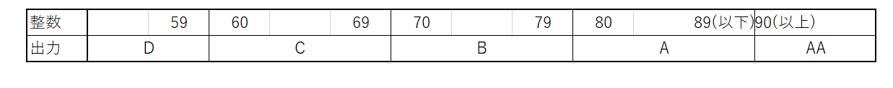
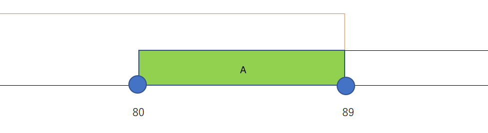
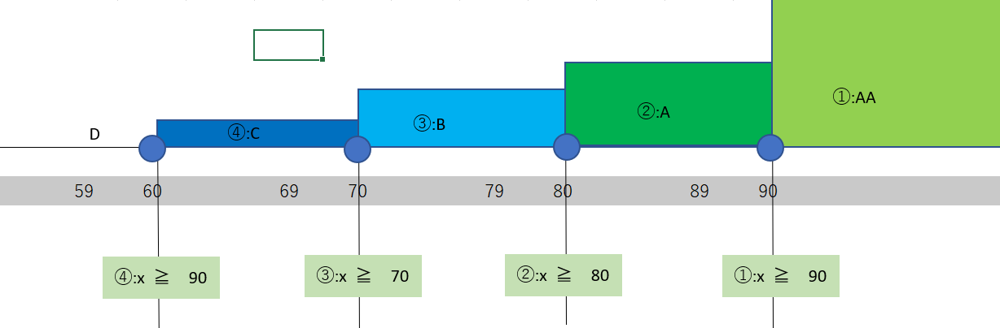

# 練習問題4-1 

**問題文**

整数を入力して、

90以上ならばAAを、

80以上89以下ならばAを、

70以上79以下ならばBを、

60以上69以下ならばCを、

59以下ならばDを

出力してください

**解説**

今回の入力する値と出力をまとめると、下の図のようになります。


また、出力がAになる範囲は数直線で表すと、下の図のようになります。


入力する整数をxとして、この範囲を不等号で表すと、`80 ≦　x　≦ 89` になり、これは、　`x　≧　80　と　x　≦ 89` を両方満たす区間に等しくなります。

if文で2つの条件を同時に満たしているときのみ、真にするには、論理演算子の`&&`を使います。

ほかの出力の場合も同様に行うと、次のようなソースコードになります。

**解答例1**
```c
#include <stdio.h>

int main()
{
    int p;
    scanf("%d", &p);

    if (p >= 90)
    {
        printf("AA\n");
    }
    if (p >= 80 && p <= 89)
    {
        printf("A\n");
    }
    if (p >= 70 && p <= 79)
    {
        printf("B\n");
    }
    if (p >= 60 && p <= 69)
    {
        printf("C\n");
    }
    if (p <= 59)
    {
        printf("D\n");
    }

    return 0;
}
```
また、`if`文を`if-else`文で書いても同様にできます。

**解答例2**
```c

#include <stdio.h>

int main()
{
    int p;
    scanf("%d", &p);
    
    if (p >= 90)
    {
        printf("AA\n");
    }
    else if (p >= 80 && p <= 89)
    {
        printf("A\n");
    }
    else if (p >= 70 && p <= 79)
    {
        printf("B\n");
    }
    else if (p >= 60 && p <= 69)
    {
        printf("C\n");
    }
    else if (p <= 59)
    {
        printf("D\n");
    }
    return 0;
}
```

ここで、`if-else` の流れについてみていきましょう。

```c
...(省略)

if(条件式A){
    //a
}else if(条件式B){
    //b
}else{
    //c
}
    //d
(省略)...
```

このプログラムの場合、最初のif文で条件式Aを満たしている場合はaを実行し、bとcを飛ばし、dを実行します。

条件式Aを満たしていないもので`else if`文の条件式Bを満たしている場合はbを実行し、cをとばして、dを実行します。

条件式Aも条件式Bも満たしていないものはcとdを実行します。

このように、`else if`文に入るものは、必ず前の`if`は必ず、偽になっているので、このような考え方ができます。

(〇の中の数字は見ていく順番)

また、今回入力されるのは、整数なので、59以下は60未満と同じように考えても大丈夫です。

そのため、Aを出力する範囲の80以上89以下は80以上90未満と言い換えることができ、AAを出力する範囲である90以上は偽になっているので、
```c
if(x >= 90)
{
        //AAの範囲
}
else if(x >= 80)
{
    //Aの範囲
}...(略)
```
と書くことができます。
これを踏まえると、次のようなソースコードになります。

**解答例3**
```c
#include <stdio.h>

int main()
{
    int p;
    scanf("%d", &p);
    if (p >= 90)
    {
        printf("AA\n");
    }
    else if (p >= 80)
    {
        printf("A\n");
    }
    else if (p >= 70)
    {
        printf("B\n");
    }
    else if (p >= 60)
    {
        printf("C\n");
    }
    else
    {
        printf("D\n");
    }
    return 0;
}
```

# 練習問題4-2 

**問題文**

2つの整数:a,bを入力して、a-bの絶対値を出力してください。

**解説**
ある値の絶対値とは、ある値の原点からの距離です。

例えば、3の絶対値は3の原点からの距離である3です。
また、-5の絶対値は-5の原点からの距離である5です。

簡単にいうと、ある値の絶対値はある値の符号を取ったものです。

(絶対値は必ず正の値をとることに注意)

これ以降、aの絶対値を`|a|`として表現します。

`|a-b|`の値を求める方法は主に3つあります。

*方法１* 絶対値の性質を使う

`|a-b|`はaとbの大小によってつぎのように変形することができます。

- a ≧b　のとき、|a-b|=a-b
- a \< b　のとき、|a-b|=b-a

この考え方でソースコードを書くと、このようになります。

**解答例1**
```c
#include <stdio.h>

int main()
{
    int a, b;
    scanf("%d", &a);
    scanf("%d", &b);
    if (a >= b)
    {
        printf("%d\n", a - b);
    }
    else
    {
        printf("%d\n", b - a);
    }

    return 0;
}
```

*方法2* 答えを出力する用の変数を作る

まず、入力を入れる変数を宣言するときに、答えをいれる変数を宣言します。

変数を格納したあとに、答えを入れる変数に、とりあえず`a-b`の値を代入しておきます。

`|a-b|`は正の値をとるので、答えを入れる変数が0未満かをみて、0未満ならば、-1をかけて、正にしたあと、答えを出力します。

この考え方でソースコードを書くと、このようになります。

**解答例2**
```c
#include <stdio.h>
int main()
{
    int a,b;
    scanf("%d", &a);
    scanf("%d", &b);
    int ans=a-b;
    if(ans<0){
        ans=ans*-1;
    }
    printf("%d\n",ans);
    return 0;
}
```

*方法3* <stdlib.h>内のabs関数をつかう

方法1や2のように、絶対値の性質を考えなくても、簡単にプログラムを書くことができます。

その方法は`system("chcp 65001");`を使うときにインクルードした`<stdlib.h>`内にある関数:`abs`を使う方法です。

abs関数は`abs(int a)`のように使って、`|int a|`を返します。
この関数をつかってソースコードを書くと、このようになります。

**解答例3**
```c
#include <stdio.h>
#include <stdlib.h>

int main()
{
    int a, b;
    scanf("%d", &a);
    scanf("%d", &b);
    printf("%d\n", abs(a - b));
    return 0;
}
```
# 練習4-3

**問題文**　
整数m(1 ≦ m ≦ 12)を入力して、

2020年のm月が何日あるかを整数で出力してください。

ただし、2020年の月末は次の通りです。

1月:31日

2月:29日

3月:31日

4月:30日

5月:31日

6月:30日

7月:31日

8月:31日

9月:30日

10月:31日

11月:30日

12月:31日


**解説**

今回は、入力した値によって、出力する値を変えるので、`switch`文が使えそうです。

まずは、問題文通りに`case`文をつかって書いてみると、つぎのようなソースコードになります。

**解答例**

```c
#include <stdio.h>

int main()
{
    int m;
    int ans = 0;
    scanf("%d", &m);
    switch (m)
    {
    case 1:
        ans = 31;
        break;
    case 2:
        ans = 29;
        break;
    case 3:
        ans = 31;
        break;
    case 4:
        ans = 30;
        break;
    case 5:
        ans = 31;
        break;
    case 6:
        ans = 30;
        break;
    case 7:
        ans = 31;
        break;
    case 8:
        ans = 31;
        break;
    case 9:
        ans = 30;
        break;
    case 10:
        ans = 31;
        break;
    case 11:
        ans = 30;
        break;
    case 12:
        ans = 31;
        break;
    }
    printf("%d\n", ans);
    return 0;
}
```
(ans=0で初期化している理由はmに予想外の値が入って、ansの値が代入されない場合に備えるためです)

ほかにも、出力の値に応じて、順番を入れ替えて、
```c
...(略)
switch(m){
    case 1:
    case 3:
    case 5:
    case 7:
    case 8:
    case 10:
    case 11:
    case 12:
        ans=31;
        break;
    case 2:
        ans=29;
        break;
    case 4:
    case 6:
    case 9:
        ans=30;
    break;

    (略)...
}
```
のように書く方法もありますが、この方法はバグを生み出す原因になるので、やらないほうが望ましいです。
