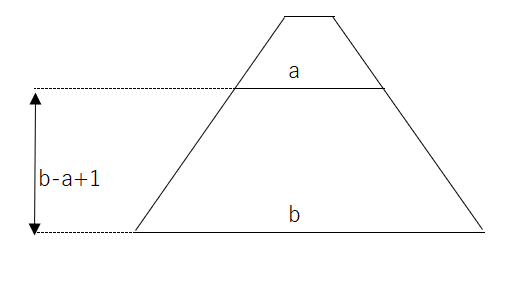

# 練習問題5-1 

**問題文**

2つの整数a,b(a < b)を入力して、

aからbまでの整数をすべて足したときの総和を出力して下さい 。

**解説**

2,6を入力したときにどのような値を出せばいいのかを考えて行きましょう。

2から6までの整数をすべて足したときの総和は2+3+4+5+6と表され、これを計算すると、20になります。

これをプログラムで実行させるにはどうすればいいのでしょうか。

一つの方法は初期条件を`i=a`,継続式を`i<=b`,増減を`i++`の`for`文で書くもので、その時のiの値はaから始まり、bまで、`for`文のループを繰り返すたびに1つづ大きい値が代入されます。

あとは、答えの出力用の変数を用意して、0で初期化して、(そうしないと加算がうまくいきません)for文で答えの出力用の変数にiを値を加算し、`for`文のそとで答えの出力用の変数を出力させることでaからbまでの整数をすべて足したときの総和を出力することができます。

このように考えると、次のようなソースコードになります。

**解答例1**
```c
#include <stdio.h>

int main()
{
    int a, b;
    scanf("%d", &a);
    scanf("%d", &b);
    int ans = 0; //答えの出力用の変数
    int i = 0;
    for (i = a; i <= b; i++)
    { //iをaからはじめて、b以下の間、繰り返すごとにiの値を1づつ増やす
        ans += i;
    }
    printf("%d\n", ans); //答えを出力
}
```

また、`for`文を使わず、下の図のように考えることもできます。



このように、上底がa、下底がb、高さが`b-a+1`の台形を考えるとその面積、つまり、`(上底 + 下底) * 高さ　/ 2`が答えになります。

このように考えると次のようなソースコードになります。

**解答例2**
```c
#include <stdio.h>

int main()
{
    int a, b;
    scanf("%d", &a);
    scanf("%d", &b);
    int ans = 0; //答えの出力用の変数
    
    ans=(a+b)*(b-a+1)/2;
    
    printf("%d\n", ans); //答えを出力
}
```

# 練習問題5-2 

**問題文**

整数:a(1 < a)を入力して、

aからはじめ、１づつ引いた値を1まで出力し、1を出力したあとに`GO!`と出力してください。

**解説**

5を入力してときを考えてみましょう。
5からはじめ、１づつ引いた値を1まで出力し、1を出力したあとに`GO!`と出力するので、出力は
```
5
4
3
2
1
GO!
```
となります。

これをプログラムで実行させるにはどうすればいいのでしょうか。

その方法はおもに2つあります。

*方法1* `while`文を使う

一つ目の方法は、入力を格納する変数:aが1以上の間ループする`while`文を使って、ループ内でaの値を出力し、aの値を1づつ減らしす命令をいれます。
この命令で
```
5
4
3
2
1
```
の部分が出力され、あとは`while`文を抜けたところでGO!を出力する命令を書くことで、最後にGO!が出力されます。

この考え方で書くと、このようなソースコードになります。

**解答例1**
```c
#include <stdio.h>

int main()
{
    int a;
    scanf("%d", &a);
    while (a >= 1)
    {
        printf("%d\n", a);
        a--;
    }
    printf("GO!!\n");
}
```
*方法2*  for文を使う
方法1の`while`文は,iをaから初めて、iが1以上の間ループを繰り返し、繰り返すごとにiを1づつ減らす`for`文に置き換えることができます。

この考え方で書くと、次のようなソースコードになります。

**解答例2**
```c
#include <stdio.h>

int main()
{
    int a;
    scanf("%d", &a);
    int i;
    for (i = a; i >= 1; i--)
    {
        printf("%d\n", i);
    }
    printf("GO!!\n");
}
```

# 練習問題5-3 

**問題文**

九九の表を出力してください。

**出力例**

```
1  2  3  4 ...(略)...  9
2  4  6  8 ...(略)... 18
3  6  9 12 ...(略)... 27
        ...(略)...
9 18 27 36 ...(略)... 81
```

>hint :`printf("%3d",a)`で右詰で出力します。

**解説**
まずは、1の段のみを出力する場合を考えてみましょう。
この場合はiを1から9以下の間、ループを繰り返し、繰り返すごとにiを1づつ増やす`for`文を使って、つぎのようにできます。
```c
#include <stdio.h>

int main()
{
    int i;
    for (i = 1; i <= 9; i++)
    {
        printf("%3d", 1 * i);
    }

    return 0;
}
```
(出力)
```
  1  2  3  4  5  6  7  8  9
```
つぎに2の段までを出力してみましょう。
この場合は、先ほどやったものを2回分やるとできそうなので、もう一つのfor文を値を出力する部分と`for`文をなかに入れるようにいれます。
また、値を出力する部分は`printf("%3d",i*j);`に変更します。
```c
#include <stdio.h>

int main()
{
    int i;
    int j;
    for (i = 1; i <= 2; i++)
    {
        for (j = 1; j <= 9; j++)
        {
            printf("%3d", j * i);
        }
    }
    return 0;
}
```

これを実行すると、つぎのように出力されます。
```
  1  2  3  4  5  6  7  8  9  2  4  6  8 10 12 14 16 18
```
これを１つの段ごとに改行するにはどうすればよいでしょうか。

これは内側の`for`文を抜けたときに、改行を出力させる文を入れることでできます。

```c
#include <stdio.h>

int main()
{
    int i;
    int j;
    for (i = 1; i <= 2; i++)
    {
        for (j = 1; j <= 9; j++)
        {
            printf("%3d", j * i); //1  2  3  4  5  6  7  8  9と出力(一回目のiのfor文)
        }
        printf("\n");
    }
    return 0;
}
```
こうすることで、つぎのように、出力されます。
```
  1  2  3  4  5  6  7  8  9
  2  4  6  8 10 12 14 16 18
```
あとは、これを9の段までやることで、九九の表が出力できます。

**解答例**
```c
#include <stdio.h>

int main()
{
    int i;
    int j;
    for (i = 1; i <= 9; i++)
    {
        for (j = 1; j <= 9; j++)
        {
            printf("%3d", j * i); //1  2  3  4  5  6  7  8  9と出力(一回目のiのfor文)
        }
        printf("\n"); //改行される、以降、ニ回目のiのfor文へ
    }
    return 0;
}
```

# 練習問題5-4

**問題文**

整数:nを入力して、n段の直角三角形を出力してください。

**入力例**
```
5
```

**出力例**
```
*
**
***
****
*****
```

**解説**

これもまずは1段分出力する場合を考えてみましょう。

これは`*`を1つ出力するだけでできます。
```c
#include <stdio.h>

int main()
{
    printf("*");
    return 0;
}
```
これを実行すると、次のようになります。
```
*
```

つぎは2段分出力する場合を考えてみましょう。
まずは、`*`を1つ出力して、ループする前に改行を出力する方法でかくと、つぎにようになります。

```c
#include <stdio.h>

int main()
{
    int i;
    for (i = 1; i <= 2; i++)
    {
        printf("*");

        printf("\n");
    }
    return 0;
}
```

これを実行すると、つぎにようになります。
```
*
*
```

あとは、2段目のときに、`*`が2個出力されるようにしましょう。
printfで`**`を出力することもできますが、これだと、1段目も`**`になってしまうので、for文を使って、1段目に`*`が、2段目に`**`を出力してみましょう。

プログラムはつぎのように書けます。
```c
#include <stdio.h>

int main()
{
    int i;
    int j;
    for (i = 1; i <= 2; i++)
    {
        for (j = 1; j <= i; j++)
        {
            printf("*"); //1段目に"*"が、2段目に"**"が出力
        }

        printf("\n");
    }
    return 0;
}
```
これは次のように出力されます。
```
*
**
```
あとは、入力を格納する変数を用意して、その段数まで出力するように、外側に`for`文の継続式を'i<=(入力を格納する変数)'にすれば完成です。

**解答例**
```C
#include <stdio.h>

int main()
{
    int n, i, j;
    scanf("%d", &n);
    for (i = 1; i <= n; i++)
    {
        for (j = 1; j <= i; j++)
        {
            printf("*");
        }
        printf("\n");
    }
    return 0;
}
```
